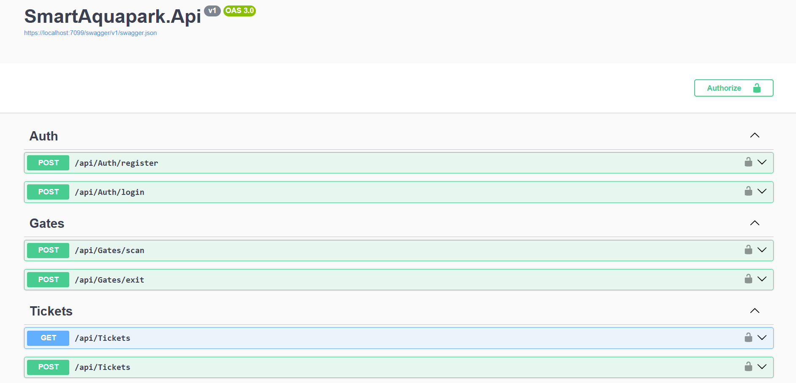
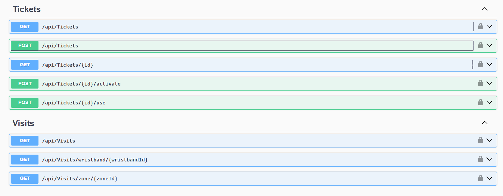
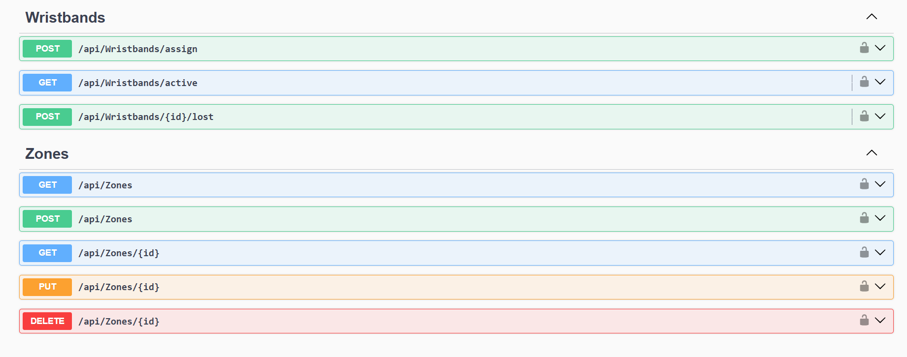
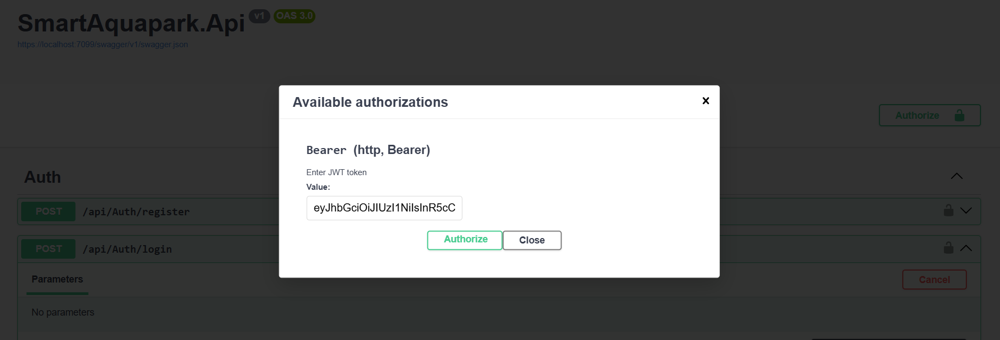
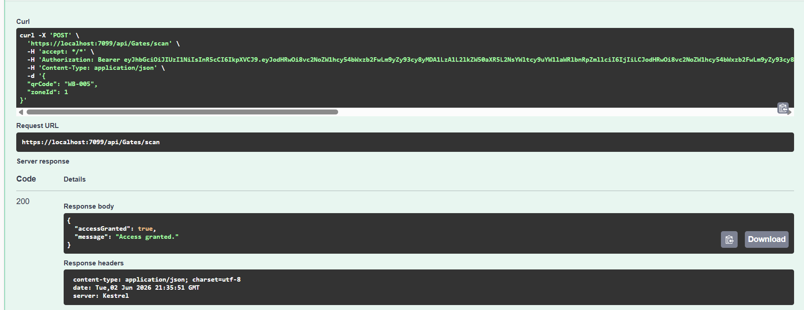
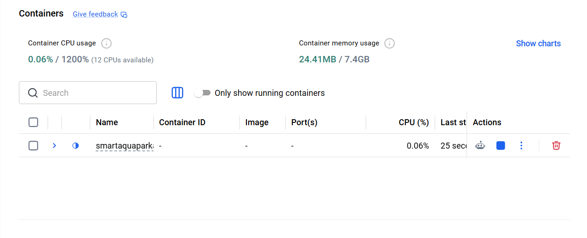

# SmartAquapark API

## Overview

SmartAquapark API is a backend system for managing aquapark operations, including ticket handling, wristband assignment, gate access validation, zone management, and visit tracking.

The project was built using ASP.NET Core and follows a layered architecture with separated Application, Domain, Infrastructure, and API layers.

The system supports JWT authentication, role-based authorization, Docker deployment, PostgreSQL database integration, and unit testing.

---

## Features

* JWT Authentication & Authorization
* Role-based access control
* Ticket management system
* Wristband assignment and activation
* Gate access validation
* Zone occupancy management
* Visit history tracking
* Global exception handling
* Request validation with FluentValidation
* Unit tests with xUnit
* Dockerized environment
* Swagger/OpenAPI documentation

---

## Tech Stack

* ASP.NET Core 10
* Entity Framework Core
* PostgreSQL
* JWT Authentication
* Docker & Docker Compose
* xUnit
* FluentValidation
* Swagger / OpenAPI

---

## Architecture

The project uses a layered architecture:

* **SmartAquapark.Api** – controllers and API configuration
* **SmartAquapark.Application** – DTOs and interfaces
* **SmartAquapark.Domain** – entities and enums
* **SmartAquapark.Infrastructure** – database context and services
* **SmartAquapark.Tests** – unit tests

---

## API Modules

### Authentication

* User registration
* JWT login

### Tickets

* Create tickets
* Activate tickets
* Use tickets
* Retrieve ticket details

### Wristbands

* Assign wristbands
* Retrieve active wristbands
* Mark wristbands as lost

### Gates

* Validate access to zones
* Handle zone exits
* Occupancy tracking

### Visits

* Retrieve visit history
* Retrieve visits by wristband
* Retrieve visits by zone

### Zones

* CRUD operations for aquapark zones

---

## Screenshots

### Swagger API Overview







### JWT Authorization



### Gate Access Validation



### Docker Environment



---

## Running With Docker

```bash
docker compose up --build
```

Swagger:

```txt
http://localhost:8080/swagger
```

---

## Running Locally

1. Configure PostgreSQL connection string in `appsettings.json`
2. Apply migrations
3. Run the API project

```bash
dotnet ef database update
dotnet run
```

---

## Running Tests

```bash
dotnet test
```

---

## Project Status

Project completed as a portfolio backend application demonstrating:

* REST API development
* Authentication & authorization
* Clean architecture concepts
* Business logic implementation
* Docker containerization
* Automated testing
